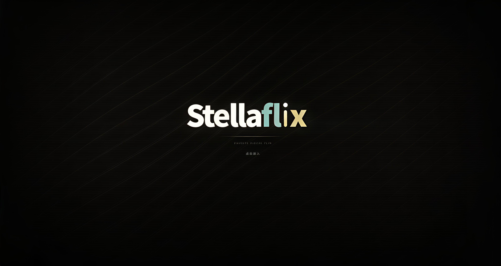

<div align="center">


# Stellaflix

**音乐 × 影视，双形态沉浸式桌面影音空间**

</div>



Stellaflix 是一款「音乐 × 影视」双形态的 Windows 桌面沉浸式影音应用：音乐态负责「听」，影视态负责「看」，两态共享同一套 3D 场景、节奏视觉与完整桌面模式，组成一个更接近现场感的私人影音空间。

基于 Electron 与 Three.js 打造，以音频节奏分析驱动镜头运动、粒子与歌词舞台——让「听歌」和「看片」在同一套视觉体系下统一呈现，而不是两个互不相干的播放器。

- **音乐态**：多平台搜索播放、歌词舞台、粒子视觉、3D 歌单架、节奏驱动电影镜头
- **影视态**：mpv/ffmpeg 解码、Emby/Jellyfin/Alist/WebDAV 接入、番剧时间线、弹幕与超分
- **桌面形态**：完整桌面模式、Wallpaper Engine 壁纸、桌面歌词，闲置自动回收资源


## 下载或安装被拦截怎么办

小众 Electron 桌面软件、未签名安装包有时会被浏览器、Windows Defender 或 SmartScreen 提示风险。请先确认安装包来自上面的网盘入口或官方 GitHub Release，文件名是 `Stellaflix-0.1.4-Setup.exe`。

1. 浏览器下载栏提示风险时，打开下载列表，点这条下载右侧的 `...` 三个点，选择 `保留` / `仍要保留` / `显示更多` 后继续保留。
2. Windows SmartScreen 弹出蓝色拦截窗口时，点 `更多信息`，再点 `仍要运行`。
3. 如果杀毒软件明确显示木马、高危或已经隔离，不要强行运行；删除该文件后重新从官方入口下载，仍然异常请带截图反馈给作者。

## 当前版本

当前版本：`0.1.4`

状态：测试版。

> 安全提示：安装包请以本页 `0.1.4` 为准安装，SHA256 校验值见 Release 附带的 `Stellaflix-0.1.4-SHA256SUMS.txt`。

## 核心特性

### 音乐形态

**播放与音源**

- 网易云音乐账号、搜索、歌单、播客接入
- QQ 音乐、汽水音乐、酷狗、Spotify 接入
- 音源质量探测与多源回退：单源不可用时自动切换备选平台
- Subsonic / Navidrome 远程音乐库
- 本地曲库管理、下载管理器、试听检测与全音质探测
- 自定义音源运行时：脚本化扩展更多音源

**视觉与歌词**

- 歌词舞台：3D 歌词网格、着色器发光、星河/蒙版纹理等多种渲染模式
- 自定义歌词上传、歌词位置与视觉控制、时间轴偏移
- 封面粒子世界与指针交互粒子系统
- 基于节奏的电影镜头视觉系统：镜头随节拍运镜
- 面向长播客和 DJ 曲目的专属视觉模式（DJ 节奏分析）
- Sonic Workshop 音效工坊与视觉预设存档（首次启动内置「默认测试」存档）
- 右键唤起 3D 歌单架，支持歌单队列浏览
- 自定义专辑封面上传与裁剪

### 影视态（视频中心）

- 解码引擎：mpv（mpv-1.dll）优先、ffmpeg 回退，支持硬解与 4K
- 媒体源协议：Emby / Jellyfin / Alist / WebDAV / HLS / magnet
- Bangumi 番剧时间线与每日放送
- TMDB 元数据与海报、弹幕引擎
- 视频超分：内置 Anime4K / FSRCNNX GLSL 着色器
- 六边形海报墙片库、观看历史与收藏（番剧按「第 N 话」聚合）

### 桌面形态

- 完整桌面模式（Full Desktop Mode）：播放器、主页、歌单全部融入桌面
- Wallpaper Engine 集成：支持加载 WE 壁纸与本地 MP4 动态壁纸
- 桌面歌词、原生桌面图标层、闲置时资源自动回收

## 技术架构

- `desktop/` — Electron 主进程：窗口/托盘/IPC、Wallpaper Engine 运行时、完整桌面模式、本地曲库、下载管理与自定义音源运行时
- `server.js` — 本地 API 服务：网易云搜索/播放/扫码登录/音频代理，受保护接口自动携带登录态，冷启动懒加载
- `*-api.js` — 平台适配层：酷狗 / 汽水 / QQ 会员 / Spotify / Subsonic / Agent 工具
- `public/js/modules/` — 渲染层 11 个模块域（state / scene / visual / beat / shelf / playback / lyrics / fx / account / shell / main-loop），原生 JavaScript，无前端框架
- `public/video/` — 影视态：播放器、源适配、番剧时间线、弹幕引擎、超分着色器
- `cuefield/` — CueField 智能混音：转场评估、歌单衔接、LRC 锚点
- `tests/` — 90+ 回归测试与验证脚本

技术栈：Electron · Node.js · 原生 JavaScript · Three.js + 自研 GLSL 着色器 · mpv/ffmpeg · electron-builder

## 使用说明

从本页列出的网盘入口或 GitHub Release 下载 `Stellaflix-0.1.4-Setup.exe` 安装；不建议直接使用 `win-unpacked` 目录。安装包会创建桌面快捷方式。

已经安装过旧版本的用户可直接运行新安装包完成更新。打包版优先走应用内自动更新；更新失败时可在浏览器打开 GitHub Release 手动下载。

开发运行：

```bash
npm install
npm start
npm run build:win
```

## 更新机制

Stellaflix 采用 **应用内自动更新为主、手动下载为辅** 的双轨更新：

1. **应用内热更新（主路径）**
   客户端通过 electron-updater 检查 GitHub（国内镜像失败回退 GitHub 直连），下载对应版本的 NSIS 安装包（`latest.yml` 校验），用户确认后静默安装并重启。下载前会做磁盘空间预检；下载失败会自动切换线路重试。
2. **GitHub Release 手动下载（降级）**
   当应用内更新不可用（开发环境、网络/校验失败、磁盘不足等）时，可在浏览器打开 Release 页面手动下载 `Stellaflix-x.y.z-Setup.exe` 安装。

### 发布要求（维护者）

若要让已安装客户端吃到应用内更新，Release 必须同时包含：

- `Stellaflix-<version>-Setup.exe`
- 同目录的 `latest.yml`（electron-builder 自动生成）
- 可选 `.blockmap`（用于差分更新，减小下载体积）

版本号必须严格高于本地版本（SemVer）。

本地验证时，可通过 `STELLAFLIX_UPDATE_MANIFEST` 指向本地 manifest JSON 或 HTTP 地址模拟线上 Release；应用内更新仅在打包安装版（`app.isPackaged`）中启用，开发模式会走外链降级。

## 参考与致谢

Stellaflix 的视觉核心——电影镜头、粒子视觉与歌词舞台——参考了开源项目 [Mineradio](https://github.com/XxHuberrr/Mineradio)（一款以电影镜头、粒子视觉和歌词舞台为核心的沉浸式音乐播放器，GPL-3.0），并在此基础上扩展出影视态与完整桌面形态。感谢 Mineradio 及其社区的工作。

## 第三方音乐平台说明

Stellaflix 不是网易云音乐、QQ 音乐或腾讯音乐娱乐集团的官方客户端，也不隶属于任何音乐平台。

项目中的第三方平台接入仅用于个人学习、本地客户端体验和用户自有账号的播放辅助。请遵守对应平台的用户协议、版权规则和会员权益规则。项目不会提供绕过付费、绕过会员、破解音质或重新分发音乐内容的能力。

## 用户数据与隐私

登录 Cookie、搜索历史、自定义封面、自定义歌词、节奏分析缓存等数据只应保存在本机用户数据目录或浏览器本地存储中，不应提交到仓库。

更多说明见 [PRIVACY.md](./PRIVACY.md)。

## 版权与授权

Copyright (C) 2026 gyr0008.

本项目采用 GPL-3.0 授权。详见 [LICENSE](./LICENSE)。

SF Logo、Stellaflix 名称、界面视觉设计与原创视觉表达归作者所有；第三方依赖和第三方服务分别遵循其各自授权与服务条款。
